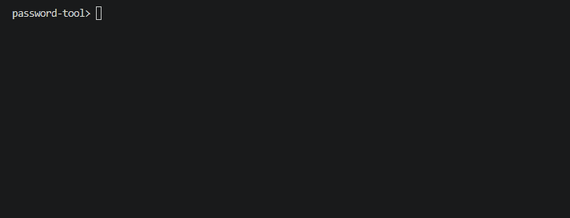
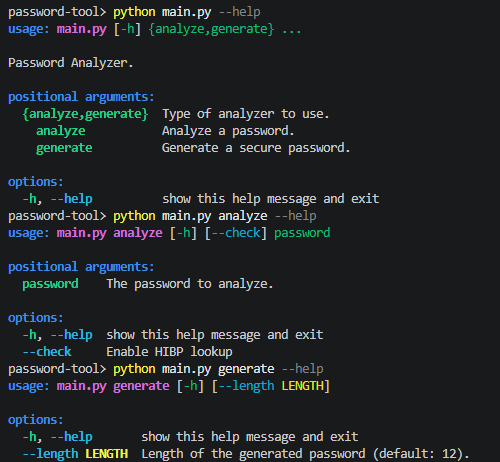

# password-analyzer-cli

A CLI tool to analyze password strength and check breaches via the Have I Been Pwned API.



## Features

- Evaluates password strength — length, entropy, character complexity
- Detects common passwords from a known dictionary
- Checks if a password has appeared in data breaches using the [Have I Been Pwned](https://haveibeenpwned.com/) API with **k-anonymity** — your password never leaves your machine
- Generates cryptographically secure passwords using Python's `secrets` module

## Tech stack

- Python 3
- `argparse` — CLI interface
- `hashlib` — SHA-1 hashing
- `secrets` — secure password generation
- `requests` — HTTP calls to HIBP API
- `collections.Counter` — character frequency analysis

## Project structure

```
password-analyzer-cli/
├── main.py          # CLI entry point
├── analyzer.py      # Password analysis logic
├── generator.py     # Secure password generation
├── hibp.py          # Have I Been Pwned integration
├── passwords.txt    # Common passwords dictionary
├── requirements.txt
└── .gitignore
```

## Installation

```bash
git clone https://github.com/msburghelea/password-analyzer-cli
cd password-analyzer-cli
python -m venv venv
source venv/bin/activate  # Windows: venv\Scripts\activate
pip install -r requirements.txt
```

## Usage

**Analyze a password:**
```bash
python main.py analyze "yourpassword"
```

**Analyze and check breaches:**
```bash
python main.py analyze "yourpassword" --check
```

**Generate a secure password:**
```bash
python main.py generate
python main.py generate --length 20
```

## Example output



```json
{
    "length": "Strong",
    "complexity": {
        "has_uppercase": true,
        "has_lowercase": true,
        "has_digits": true,
        "has_special_chars": true
    },
    "shannon_entropy": 3.58,
    "bits_entropy": 65.4,
    "is_common": false,
    "hibp": 0
}
```

## How k-anonymity works

This tool never sends your full password or its hash to any server.

1. Generates the SHA-1 hash of your password
2. Sends only the **first 5 characters** of the hash to the HIBP API
3. The API returns all hashes starting with those 5 characters
4. The comparison happens **locally** on your machine

Your password stays private at all times.

## Roadmap

- [x] CLI password analyzer
- [x] Secure password generator
- [x] HIBP breach checker with k-anonymity
- [x] REST API with FastAPI
- [x] Web frontend with React

## Related

- [Frontend — React](https://password-analyzer-frontend.vercel.app/)

## License

MIT